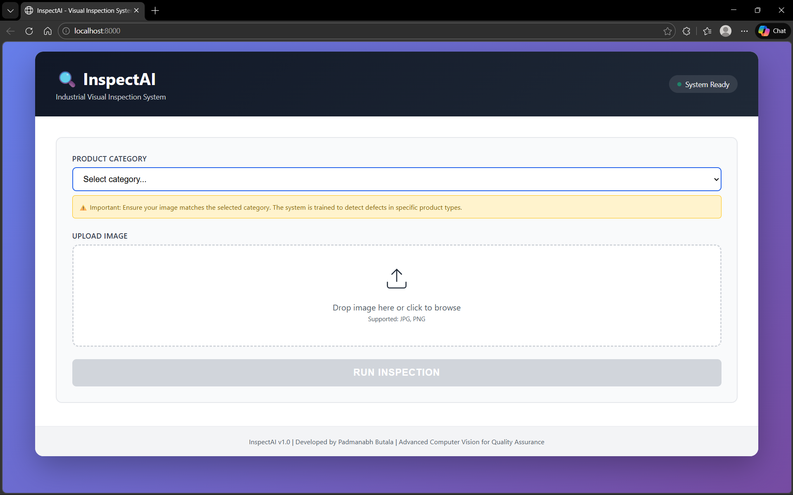
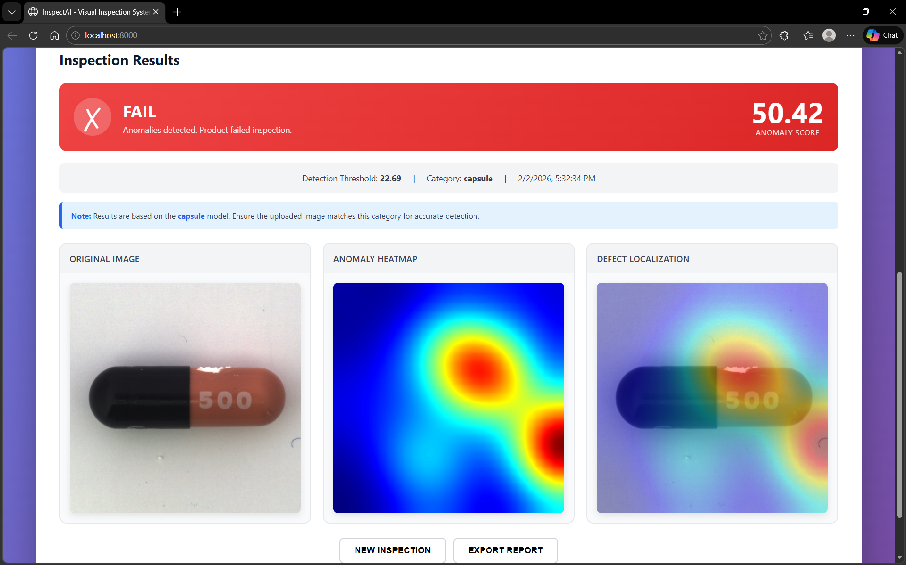
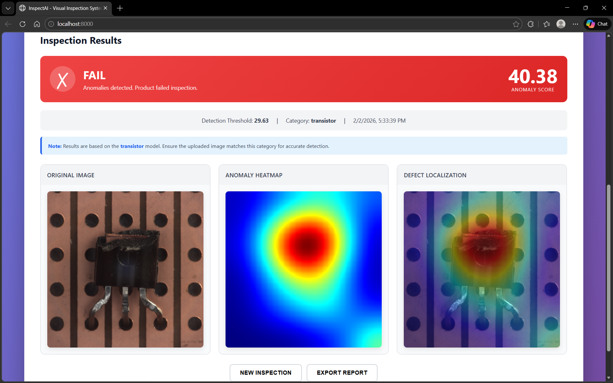
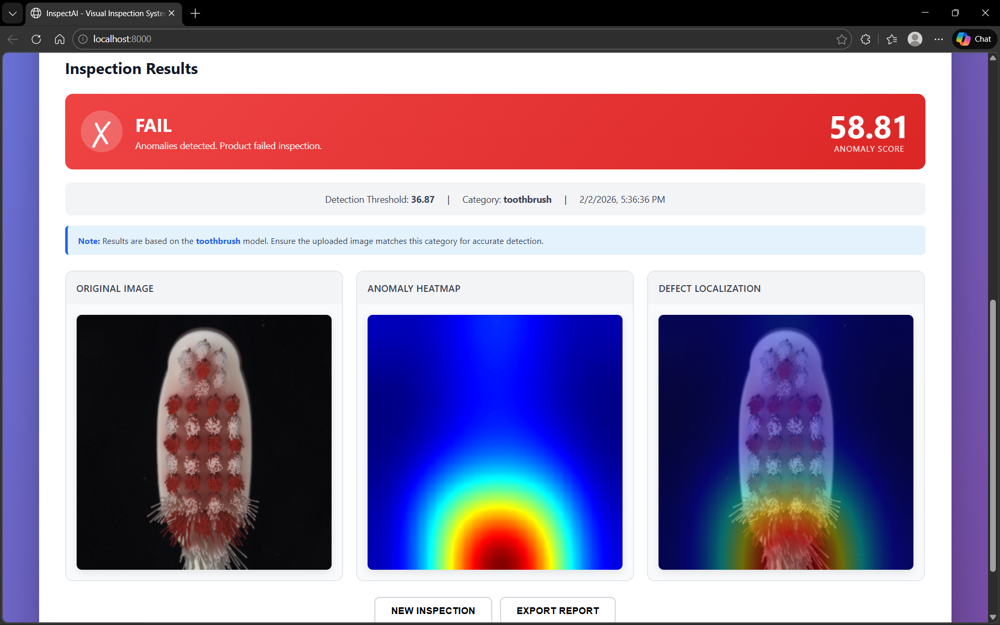
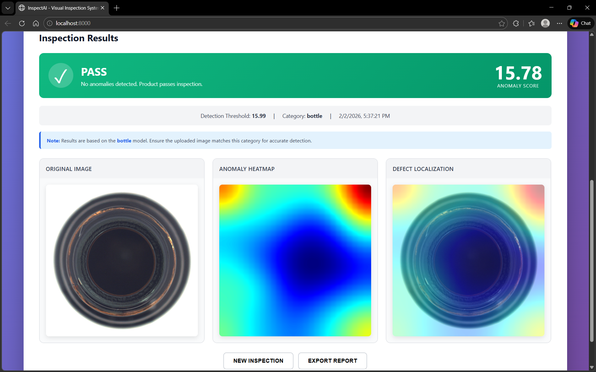

# InspectAI - Industrial Visual Inspection System

A production-ready anomaly detection system for industrial quality assurance. Built with PatchCore for unsupervised defect detection, featuring a complete web application with REST API and inspection console.

**🎯 What Makes This Special:**
- **Unsupervised Learning**: Trains on normal images only—no need for labeled defects
- **Explainable Results**: Provides pixel-level heatmaps showing exactly where defects are located
- **Production-Ready**: Full web application with REST API, not just model scripts
- **Real-World Design**: Built for QA engineers, not ML researchers
- **Transparent Decisions**: Explicit thresholding logic, not black-box predictions

## 📊 Performance

**Achieved Results (MVTec Bottle Category):**
- **Image-Level AUROC**: 99.92% ⭐
- **Pixel-Level AUROC**: 95.52% ✨
- **100% Recall**: Catches all defects without missing any
- **Inference Speed**: ~4.5 images/second

## 🎯 Features

- **Complete Web Application**: Full-stack solution with FastAPI backend and modern frontend
- **PatchCore Algorithm**: State-of-the-art anomaly detection using WideResNet50 backbone
- **Real-time Visualization**: Interactive heatmaps showing exact defect locations
- **Memory Bank**: Efficient coreset sampling to reduce memory footprint
- **Multi-Scale Features**: Extracts features from multiple layers (layer2 + layer3)
- **Automatic Thresholding**: Computes threshold from normal training data
- **REST API**: Complete API with model caching for production use
- **15 Product Categories**: Pre-trained models for bottle, cable, capsule, carpet, grid, hazelnut, leather, metal_nut, pill, screw, tile, toothbrush, transistor, wood, zipper
- **Comprehensive Evaluation**: Image-level and pixel-level AUROC metrics

## 🌐 Web Application

InspectAI includes a production-ready web inspection console:

### Interface Overview

*Clean, intuitive interface for quality inspection with category selection and drag-and-drop upload*

**Features:**
- 🎨 Modern UI with purple gradient design
- 📤 Drag-and-drop image upload
- 📊 Real-time anomaly detection
- 🔥 Interactive heatmap visualization
- ✅ Clear PASS/FAIL decisions
- 📈 Detailed anomaly scores and thresholds

### Running the Application

**Start the server:**
```bash
python start_app.py
```

**Access:**
- **Web Interface**: http://localhost:8000
- **API Documentation**: http://localhost:8000/docs
- **Health Check**: http://localhost:8000/health

**Note**: This system runs on localhost. The model files (1.7GB total) exceed free hosting tier limits. Local deployment provides full functionality with excellent performance.

## 🎯 Detection Examples

### ❌ Defect Detection (FAIL)

**Capsule with Crack** - Anomaly Score: 50.42

- ❌ **Decision**: FAIL
- 🔴 Red heatmap highlights crack location
- 📊 Score: 50.42 (Threshold: 22.69)
- 🎯 Precise defect localization in overlay

**Transistor Damage** - Anomaly Score: 40.38

- ❌ **Decision**: FAIL
- 🔴 Burned/damaged chip component detected
- 📊 Score: 40.38 (Threshold: 29.63)
- 🎯 Heatmap focuses on central defect

**Toothbrush Contamination** - Anomaly Score: 58.81

- ❌ **Decision**: FAIL
- 🔴 Color/pattern anomalies detected
- 📊 Score: 58.81 (Threshold: 36.87)
- 🎯 Multiple defect regions highlighted

### ✅ Normal Product (PASS)

**Good Bottle** - Anomaly Score: 15.78

- ✅ **Decision**: PASS
- 🔵 Blue heatmap indicates normal regions
- 📊 Score: 15.78 < Threshold: 15.99
- ✨ Product passes quality inspection

## 📁 Project Structure

```
Inspect_AI/
├── patchcore/               # Core PatchCore module
│   ├── __init__.py
│   ├── model.py            # Main PatchCore model
│   ├── feature_extractor.py # Feature extraction with WideResNet50
│   ├── memory_bank.py      # Memory bank with coreset sampling
│   └── utils.py            # Utility functions
├── train.py                # Training script
├── inference.py            # Inference script
├── evaluate.py             # Evaluation script
├── config.py               # Configuration settings
├── requirements.txt        # Python dependencies
├── mvtec_anomaly_detection/ # Dataset (already present)
├── models/                 # Trained models (created during training)
│   └── patchcore/
│       └── bottle/
│           ├── memory_bank.npy
│           └── config.json
└── results/                # Inference results (created during inference)
    └── bottle/
        ├── good/
        ├── broken_large/
        └── evaluation/
```

## 🚀 Quick Start

### 1. Install Dependencies

```bash
pip install -r requirements.txt
```

**Note**: If you have a CUDA-capable GPU, the system will automatically use it. Otherwise, it will fall back to CPU (slower).

### 2. Train on Bottle Category (Single Category)

```bash
python train.py --category bottle
```

This will:
- Load all training images from `mvtec_anomaly_detection/bottle/train/good/`
- Extract features using WideResNet50
- Build memory bank with coreset sampling
- Compute anomaly threshold
- Save model to `models/patchcore/bottle/`

### 3. Run Inference

**Inference on all test images:**
```bash
python inference.py --category bottle
```

**Inference on a single image:**
```bash
python inference.py --category bottle --image "mvtec_anomaly_detection/bottle/test/broken_large/000.png"
```

### 4. Evaluate Performance

```bash
python evaluate.py --category bottle
```

This will compute:
- **Image-level AUROC**: Overall anomaly detection performance
- **Pixel-level AUROC**: Defect localization accuracy
- **Confusion Matrix**: TP, TN, FP, FN
- **Per-defect-type analysis**: Score distribution for each defect type

## 📊 Expected Results (Bottle Category)

Based on PatchCore paper and MVTec benchmarks:
- **Image-level AUROC**: ~98-99%
- **Pixel-level AUROC**: ~97-98%

## 🔧 Advanced Usage

### Train on All Categories

```bash
python train.py --all
```

### Evaluate All Categories

```bash
python evaluate.py --all
```

### Use CPU Instead of GPU

```bash
python train.py --category bottle --device cpu
```

### Custom Configuration

Edit `config.py` to modify:
- Backbone network
- Feature extraction layers
- Coreset sampling ratio
- Number of neighbors for scoring
- Threshold computation method
- Image size

## 📈 Outputs

### Training
- `models/patchcore/{category}/memory_bank.npy`: Saved memory bank
- `models/patchcore/{category}/config.json`: Model configuration

### Inference
- `results/{category}/{defect_type}/{image}_result.png`: Visualization with original, heatmap, and overlay
- `results/{category}/{defect_type}/{image}_heatmap.png`: Colored heatmap

### Evaluation
- `results/{category}/evaluation/roc_curve.png`: ROC curve
- `results/{category}/evaluation/score_distribution.png`: Score distribution histogram
- Console output with detailed metrics

## 🎨 Visualization Examples

Each inference result includes:
1. **Original Image**: Input image
2. **Anomaly Heatmap**: Heat map showing anomaly scores per region
3. **Overlay**: Heatmap blended with original image
4. **Ground Truth** (if available): Pixel-level defect mask

## 🔍 How It Works

### Training Phase
1. Load defect-free images from `train/good/`
2. Extract multi-scale patch features using WideResNet50
3. Apply greedy coreset sampling to reduce memory (~10% of patches)
4. Build FAISS index for efficient nearest-neighbor search
5. Compute anomaly threshold from training data

### Inference Phase
1. Extract patch features from test image
2. For each patch, find nearest neighbor in memory bank
3. Compute distance as anomaly score
4. Generate spatial anomaly heatmap
5. Image-level score = max patch score
6. Apply threshold for binary classification

### Evaluation Phase
1. Run inference on all test images
2. Compute image-level AUROC (detection)
3. Compute pixel-level AUROC (localization)
4. Generate ROC curves and confusion matrix

## 🛠️ Troubleshooting

### CUDA Out of Memory
- Reduce `IMAGE_SIZE` in `config.py` (e.g., from 224 to 128)
- Use `--device cpu` flag
- Reduce `CORESET_SAMPLING_RATIO`

### Slow Training
- Normal: Feature extraction is compute-intensive
- Expected time: 2-5 minutes for bottle category (GPU)
- CPU: 10-20 minutes

### Low AUROC
- Ensure you're using the correct category
- Check that training data only contains defect-free images
- Verify ground truth masks are available for evaluation

## 📝 Command Reference

### Training
```bash
python train.py --category bottle          # Train single category
python train.py --all                      # Train all categories
python train.py --category bottle --device cpu  # Use CPU
```

### Inference
```bash
python inference.py --category bottle                              # All test images
python inference.py --category bottle --image path/to/image.png   # Single image
python inference.py --category bottle --no-save                   # Don't save results
```

### Evaluation
```bash
python evaluate.py --category bottle       # Evaluate single category
python evaluate.py --all                   # Evaluate all categories
python evaluate.py --category bottle --no-plots  # Skip plots
```

## 🌟 Next Steps

After validating the PatchCore engine:
1. ✅ Test on bottle category
2. ✅ Scale to all 15 categories
3. 🔜 Build web application (Flask/FastAPI + React)
4. 🔜 Add database for inspection history
5. 🔜 Deploy as production service

## 📚 References

- **PatchCore Paper**: [Towards Total Recall in Industrial Anomaly Detection](https://arxiv.org/abs/2106.08265)
- **MVTec AD Dataset**: [MVTec Anomaly Detection Dataset](https://www.mvtec.com/company/research/datasets/mvtec-ad)

## 📄 License

This implementation is for research and educational purposes.
